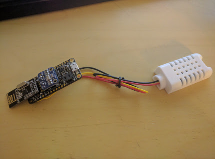
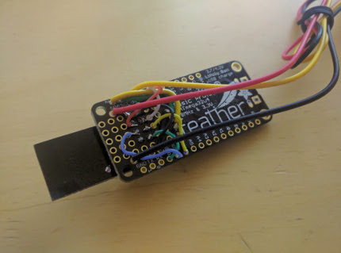

{
  "title": "Weather Station Part 2",
  "date": "4/15/17",
  "hash": 1395718268
};

I have started working on the main board for the station.  Adding the transeiver, barometer, temperature, and humidity sensor.  It is going pretty well so far.  I have not yet tested the rf24 module, though the two other modules I have confirmed to work.  The MPL115 works pretty well, and seems to give good readings, though I can't really test it without putting it in a vacuum chamber or climbing a mountain, which is fairly difficult, let alone trying to tether it to a computer.  The humidity sensor reads humid in my mouth, and the temperature sensor senses the proper temperature.

  

    
  

  

    
  

I was also able to do some testing on the old equipment.  Most of it worked how I expected it would, though with a little twist. I started with the wind meter.

The wind meter will be the easiest to implement.  It has a single switch that pulses every 180°. The switch closed most of the time except for when pulsing, which opens the circuit.  It will be really easy to implement as I only need to find the amount of time between two pulses.  The hard part will be finding the conversion rate between rpm and airspeed.  I wouldn't be surprized if the information is readily online, but if it is not, I can take a few readings in a car ride at a set speed in a no wind envirenment.

Next is the Rain Gage.  It is fairly simple, though it will be a bit harder to implement.  The Rain gage collects water in a see-saw thing.  the water goes to one side until its bucket fills up and rocks the see-saw to the other side. This process repeats, but on the other side. when the bucket falls, switch is pulsed.  To implement, you just have to keep track of how many times the bucket dropped.  It is really simple in principal, though in practice will require the system to always be listening for the switch to switch.  An interrupt should do the trick.  As for conversions, I believe each bucket drop is 0.01in, as that was the increment of the station before it broke, but I will have to confirm; Probably by leaving it out on a rainy day with rain bucket as a base.

The last is the weather vain, arguably the most difficult to implement.  There are eight switches, one for each direction.  each switch is paralel to each other with a different resister paired with each.  The resistors value seems to be random, making it more difficult to implement, though not by much.  To implement, I would use a 100k pull-down resister to get the following table.  Though what I found interesting is that my readings from the last post are different to what the calculated resistance is.

 
<table>
  <tr>
    <th>Direction</th>
    <th>Resistance (expected)</th>
    <th>Resistance (actual)</th>
    <th>Voltage</th>
  </tr>
  <tr>
    <td>South</td>
    <td>33k</td>
    <td>762k</td>
    <td>0.58V</td>
  </tr>
  <tr>
    <td>SouthWest</td>
    <td>8k2</td>
    <td>184k1</td>
    <td>1.76V</td>
  </tr>
  <tr>
    <td>West</td>
    <td>1k</td>
    <td>infinity</td>
    <td>0V</td>
  </tr>
  <tr>
    <td>NorthWest</td>
    <td>2k2</td>
    <td>50k1</td>
    <td>3.33V</td>
  </tr>
  <tr>
    <td>North</td>
    <td>3k9</td>
    <td>87k9</td>
    <td>2.66V</td>
  </tr>
  <tr>
    <td>NorthEast</td>
    <td>16k</td>
    <td>362k9</td>
    <td>1.08V</td>
  </tr>
  <tr>
    <td>East</td>
    <td>120k</td>
    <td>3m23</td>
    <td>0.15V</td>
  </tr>
  <tr>
    <td>SouthEast</td>
    <td>64k9</td>
    <td>1m56</td>
    <td>0.3V</td>
  </tr>
</table>

I am certain that I am wrong about the resistance, either in my calculations, or my setup, but I remember reading the resistance on my meter to be correct.
