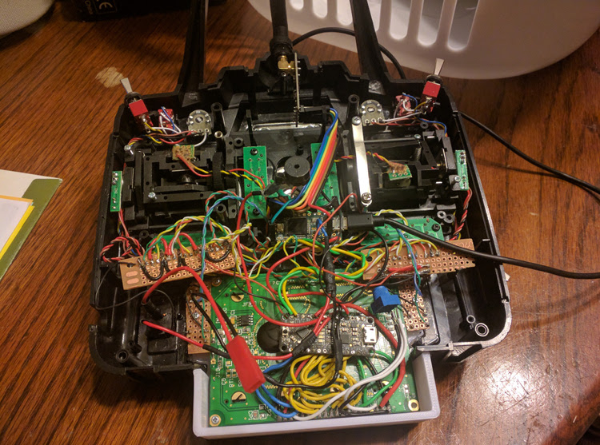

{
  "title": "RC Remote Software",
  "date": "10/24/17 9:00",
  "unix": 1508857200000,
  "hash": -1628103299,
  "files": [
    "remote_wiring.jpg",
    "remote_wiring_small.jpg"
  ],
  "description": "I am done building my RC Remote and have started developing the software for both the comms library, as well as the remote itself.",
  "tags": "rc, remote, software",
  "author": "Benjamin Jacobs"
};

Over the course of the past year or so, I have torn apart an old RC Remote and put new electronics in. I think I have blogged about it before I rebuilt my website, and hope to restore those lost posts some day.  I have since stopped working on it until about a week ago.

  

I discovered [PlatformIO](http://platformio.org/), a plugin for Visual Studio Code, that allows for development on just about any embedded computer.  This allowed me to start developing the software for my remote in full.

I have planned to write the software in two parts: The comms library, and the Remote software.  The comms library is an API designed to work with nRF24L01 chips and is built for both the transmitter and receiver.  The remote Software allows the comms library to work with the hardware of the remote.

Comms Library
---

The comms library also has two parts: The Receiver, and the Transmitter.  The receiver is the class a device connecting to the remote would use, while the transmitter is the class the remote would use.  They are built to work with each other, and so both can be explained simultaneously.

The library will allow a transmitter to pair with more than one device, along with device-specific settings that would be stored in the transmitter (The library doesn't save the settings, but asks the remote to save/retrieve them).  When the transmitter connects, it waits for the receiver to announce its ID on the transmitter's channel, the transmitter will then load the settings for that device, and check if all the requirements are valid.  If the requirements are not valid, the remote should warn the user, and ask what to do, while the device waits for further commands.  If everything is good, the remote should alert the user that the connection was successful.

You should also be able to have add-ons: a device that can communicate with the receiver through the transmitter.  An example of an add-on is a Gymbal remote; you would be able to control a gimbal mounted on a quadcopter from a second remote without having a second transmitter.  The receiver can specify in the settings wither a specific add-on is required, and which channels from an add-on to send, or which telemetry channels to send to an add-on.  The main transmitter is also considered to be an add-on (its ID is 0) so can have specific channels excluded from the transmission.

Remote Software
---

The software for the remote handles all of the specifics that the comms library can't.  It will control the display, EEPROM, and handle inputs.  The screen will be controlled by a UI class that controls several subscreen objects.

The menu structure will be set up something like this

        mainscreen
        |---Settings
                |---System Settings
                        |---Connect On startup
                        |---Channels Graph
                        |---Reverse Channels
                        |---Change ID
                        |---Forget All receivers
                        |---etc
                |---Receiver Settings
                        |---Change Name
                        |---Change Background Image
                        |---Forget This Receiver
                        |---etc

I have already gotten the basic structure for the UI setup, but I haven't done much more than that.  I plan to get a connection between the receiver and transmitter done next.
