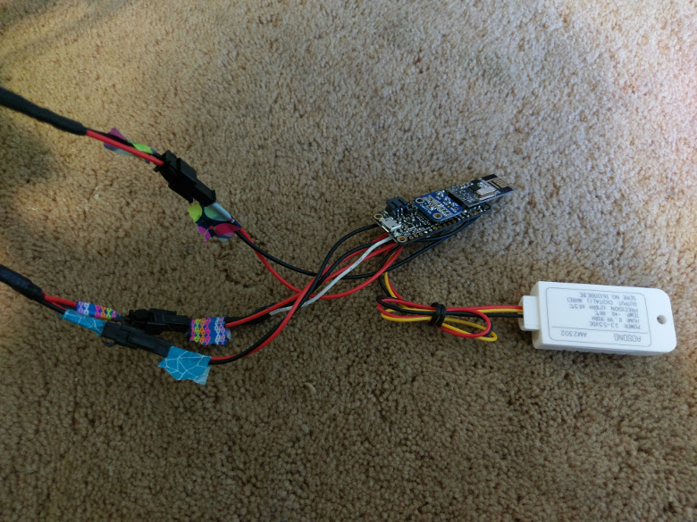

{
  "title": "WeatherStation: Software",
  "date": "6/17/17",
  "unix": 1497679200000,
  "hash": -573510349,
  "files": [
    "flowchart.png",
    "flowchart_web.png",
    "wiring.jpg",
    "wiring_web.jpg"
  ],
  "description": "I started planning the software structure",
  "tags": "weather station, software",
  "author": "Benjamin Jacobs"
};

I finished wiring the station, though I would not be surprised if I need to make some last minute adjustments.  The last bit of wiring I have done is interfacing with the existing hardware.  The rain gauge and anemometer connect directly to the board with an internal pull-up activated.  The language is connected to D11 for PCINT7 which allows for interrupts.  The weather vane is connected to A0 through a 5k7 resistor to act as a voltage divider with the resistors in the weather vain as the second resistor.  The solar panel connects to the USB pin through a step-up converter to make sure there is a 5V output.

  

As for the software, I created a simple flowchart of what the station will do.

  

The Program will wait for commands, I expect to update once every 30 seconds.  It will then process the command, then repeat.  It is a very simple system. though will be slightly more complex than that.

I haven't programmed the commands yet, rather got or getting the processes ready to be commanded. So far have had weatherdump mostly finished, as well as settingdump.  They are not yet functional enough to be plugged into a communications API, but the framework is there.

#### WeatherDump

The weatherdump sends back all of the weather data from about the time the dump was requested.  It should start out collecting the wind data as that takes at least 2 seconds.  Everything else reads fairly quickly.  Next is the weather vain, which just finds which of the eight reed switches are closed.  The temperature and humidity come from the DHT22, and pressure comes from the MPL115.  The grain count is stored in a variable that may or may not reset after each reading(I haven't decided yet)

#### SettingDump

All of the settings are stored in the internal EEPROM.  The settings are fairly simple, just conversions or other various settings regarding weather data.  I am doing this so that if I find an error with my system, I can easily fix the small issues without having to take down the weather station and reflash it.  I am mainly storing Integers, doubles, and booleans. As EEPROM stores its values as bytes and has no conversion systems, I have created a few converters.  The first converter simplifies the booleans into bytes to conserve memory.  The second converts Integers into two bytes.  The third converts doubles into 5 bytes.  It starts out by finding out how many bits the double needs to become a long.  After that, the long is turned into 2 ints which are then saved using the previous writeInt command.  The last 5th byte stores the number of bits the double is compressed by.
